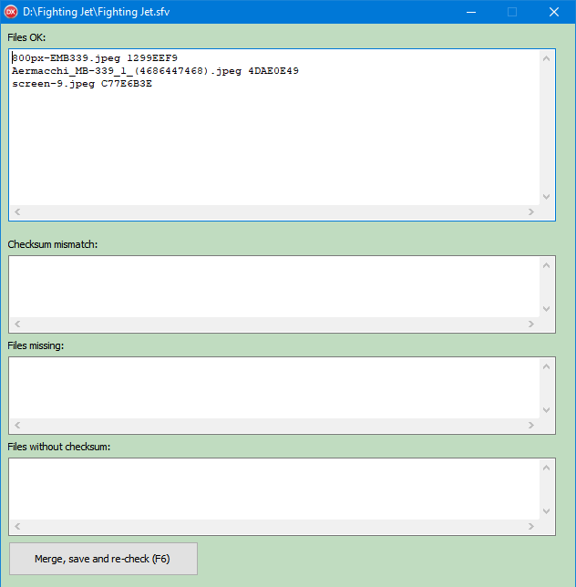
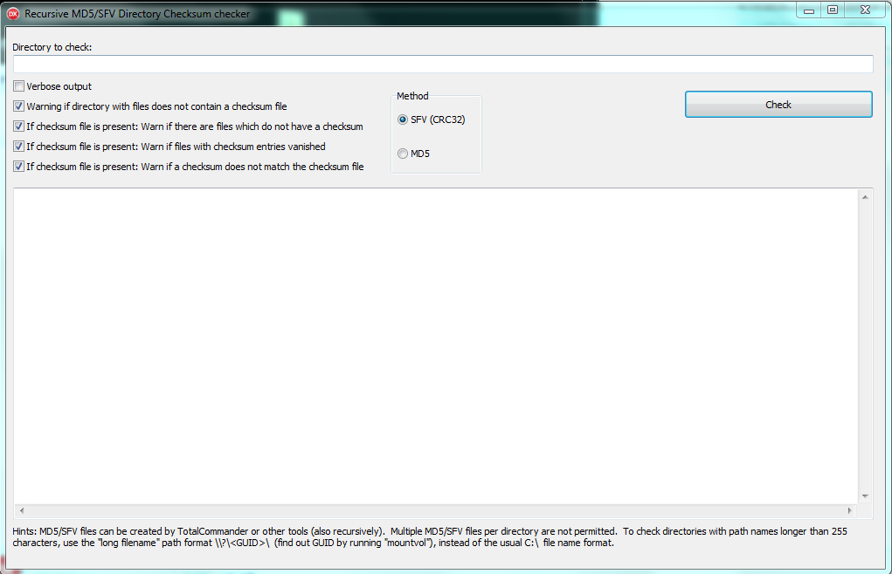

# Directory checksum generator and verifier

### Verify SFV and MD5 files recursively

This project contains two things:

* PHP Directory: md5 and sfv generator or verifier scripts in pure PHP.

* Windows Directory: Contains two tools, where you can recursively check if files have been modified (or corrupted by a file system error) by checking all directories containing "MD5" and "SFV" files recursively.

## Windows tools
[Download Setup here](https://www.viathinksoft.de/download/246/checksum_tools_setup.exe) for Windows 32 and 64 bit

### Windows tool: Checksum generate/verify/update

### Windows tool: Batch checksum verifier

